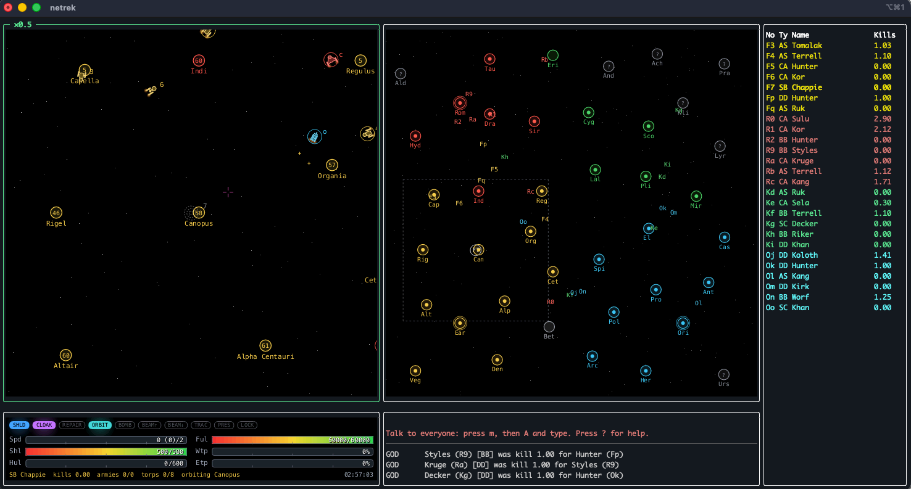

# Netrek for the terminal

A graphical client and game server for **Netrek**, the 1988 multiplayer space battle game,
that runs entirely inside a terminal window on macOS.



- **Classic layout:** tactical and galactic maps side by side as two squares, with the
  dashboard, player list and message window underneath, like the original X11 client.
- **Real graphics in the terminal:** vector-style maps and control panel drawn with
  [tiny-skia](https://github.com/linebender/tiny-skia) and sent as SIXEL images. On
  terminals without image support it falls back to color block glyphs or braille.
- **Authentic rules:** the 40-planet galaxy, the six ship classes, and weapons, fuel,
  heat, orbiting, bombing, army carrying and planet capture use numbers from the
  Vanilla Netrek server source.
- **Trek-style ships:** each empire has its own ship designs (Federation saucers and
  nacelles, Klingon D7s and Birds-of-Prey, Romulan warbirds, Orion raiders).
- **Robots:** AI pilots fight, bomb, carry armies and capture planets, so you can play solo.
- **Alien incursions** (optional): thirteen Star Trek threats, from Khan, the Borg and the
  planet killer to V'Ger, the Crystalline Entity, the whale probe, Species 8472 and the
  Jem'Hadar, drop into the game.
- **Sound:** synthesized retro sound effects, with no audio libraries required.
- **Mouse and keyboard:** aim and steer with the mouse, with the classic Netrek key bindings.

---

## Contents

- [Requirements](#requirements)
- [Build and install](#build-and-install)
- [Quick start](#quick-start)
- [Command-line reference](#command-line-reference)
- [Terminal setup and graphics modes](#terminal-setup-and-graphics-modes)
- [The screen](#the-screen)
- [Controls](#controls)
- [How to play](#how-to-play)
- [Ships](#ships)
- [Planets](#planets)
  - [Taking and retaking planets](#taking-and-retaking-planets)
- [Robots](#robots)
- [Alien incursions](#alien-incursions)
- [Sound](#sound)
- [Hosting a server](#hosting-a-server)
- [Troubleshooting](#troubleshooting)
- [Differences from classic Netrek](#differences-from-classic-netrek)
- [Project layout](#project-layout)
- [Development](#development)
- [Credits](#credits)
- [License](#license)

---

## Requirements

- **macOS** (the primary target). Linux works too; see the notes under
  [Sound](#sound).
- **Rust**, a recent stable toolchain: `brew install rust` or [rustup](https://rustup.rs).
- A terminal of at least **80×24**. **160×50 or larger** gives the classic proportions.
- Optional, for vector graphics: a terminal with SIXEL support (iTerm2, WezTerm, foot),
  or tmux 3.4+ in front of one. See [Terminal setup](#terminal-setup-and-graphics-modes).

## Build and install

```sh
git clone https://github.com/MWChapel/netrek-terminal.git && cd netrek-terminal
cargo build --release
./target/release/netrek --help
```

To put `netrek` on your `PATH`:

```sh
cargo install --path .
```

## Quick start

```sh
# Play right away: a private local server with 7 robots, you on the Federation
netrek solo

# Pick your side and ship
netrek solo --team rom --ship DD --name Tomalak
```

On the **outfit screen**, choose an empire with `f` `r` `k` `o` and a ship with
`s` `d` `c` `b` `a` `x`, then press **Enter** to launch. Move the mouse over the
tactical map to aim. Left-click fires torpedoes, right-click steers, and `0`–`9` set
your speed. Press `?` at any time for the full key list.

For a four-way war with robots flying for every empire:

```sh
netrek solo --empires all --bots 15
```

Add Star Trek villains to the mix:

```sh
netrek solo --empires all --bots 15 --aliens
```

To play with friends, one person runs a server and everyone else connects:

```sh
netrek server --bots 4            # on the host machine
netrek play host.example.com      # everyone else
```

## Command-line reference

```
netrek <COMMAND>

  server   Run a game server
  solo     Start a private local server with robots and play on it
  play     Connect to a server and play
```

### `netrek server`

| Option | Default | Meaning |
|---|---|---|
| `-p, --port <PORT>` | `2592` | TCP port to listen on (2592 is the traditional Netrek port) |
| `-b, --bind <ADDR>` | `0.0.0.0` | Address to bind; use `127.0.0.1` for local-only |
| `--bots <N>` | `6` | Robot players kept in the game |
| `-e, --empires <LIST>` | `fed,rom` | Empires the robots play for: `all`, or a comma list such as `fed,rom,kli` |
| `--aliens [LIST]` | off | Alien incursions: bare `--aliens` for all thirteen, or a list such as `khan,borg,vger`. See [Alien incursions](#alien-incursions) |
| `--alien-interval <SECS>` | `150` | Average seconds between incursions |

The server logs connections, joins, kills and planet captures to stdout.

### `netrek solo`

Starts a server on a random localhost port in the background and connects to it.

| Option | Default | Meaning |
|---|---|---|
| `--bots <N>` | `7` | Number of robots |
| `-e, --empires <LIST>` | `fed,rom` | Empires the robots play for: `all`, or a comma list |
| `--aliens [LIST]` | off | Alien incursions (all, or a list such as `khan,borg`) |
| `--alien-interval <SECS>` | `150` | Average seconds between incursions |
| `-n, --name <NAME>` | `$USER` | Your callsign |
| `-t, --team <TEAM>` | `fed` | Preferred team: `fed`, `rom`, `kli`, `ori` |
| `-s, --ship <SHIP>` | `CA` | Preferred ship: `SC`, `DD`, `CA`, `BB`, `AS`, `SB` |
| `-g, --gfx <MODE>` | `auto` | Map graphics: `auto`, `vector` (alias `sixel`), `blocks`, `braille` |
| `--mute` | off | Start with sound effects off |

### `netrek play [HOST]`

| Option | Default | Meaning |
|---|---|---|
| `HOST` | `localhost` | Server host name or address |
| `-p, --port <PORT>` | `2592` | Server port |
| `-n`, `-t`, `-s`, `-g`, `--mute` | | Same as `solo` |

The team and ship options only preselect choices on the outfit screen. You still press
Enter to launch.

## Terminal setup and graphics modes

The client picks the best graphics your terminal supports. Press `g` in game to cycle
through the modes, or force one with `--gfx`.

| Mode | Looks like | Works in |
|---|---|---|
| **vector** | Real pixel images: thin anti-aliased lines, outlined planets, crisp labels, graphical dashboard | iTerm2, WezTerm, foot, mlterm; tmux 3.4+ when configured (below) |
| **blocks** | Color block glyphs (▀ ▌ ▚ ▂ ▆ …) from a supersampled rasterizer, about 6×15 pixels per character cell | Any terminal with 256 colors; 24-bit color when available (Terminal.app, iTerm2, …) |
| **braille** | Braille-dot line art | Any Unicode terminal |

In every mode the layout is sized in real screen pixels, so the maps stay square
whatever your font's cell shape.

### iTerm2

Vector mode works out of the box. Make sure **Settings → Profiles → Terminal → Enable
mouse reporting** is on (the default) for mouse aiming.

### tmux

tmux 3.4 and newer can pass SIXEL images through, but only after you tell it the outer
terminal supports them. Add this to `~/.tmux.conf`:

```
set -as terminal-features ',xterm*:sixel'
```

Then reload the config and **detach and reattach**, because terminal features are read
when a client attaches:

```sh
tmux source ~/.tmux.conf
# prefix + d, then: tmux attach
```

If you run inside tmux without this setting, the client falls back to blocks mode and
shows a one-line hint. The outer terminal must itself support SIXEL. Inside tmux, the
client checks which app is hosting your tmux client (by walking its process tree). If
that's Terminal.app (or another terminal without SIXEL), it stays in blocks mode and
suggests attaching from iTerm2. The same tmux session can be attached from Terminal.app
and from iTerm2 at different times, and the client picks the right mode each time it
starts.

### Terminal.app

Terminal.app can't display images, so it uses **blocks** mode. That still gives shaded
planets, ship silhouettes and thin phaser beams. For the full vector look, run in
iTerm2 instead.

### Colors and fonts

- **Color:** 24-bit color is used when `COLORTERM=truecolor` (or on iTerm2, WezTerm and
  Ghostty). Otherwise it falls back to the 256-color palette.
- **Fonts:** vector mode draws text into its images with the system Menlo font (falling
  back to Monaco or SF Mono). No font setup is needed.

## The screen

```
┌──────────────── tactical ───────────────┐┌──────────────── galactic ───────────────┐┌─ players ─┐
│ your neighbourhood of space, centred on ││ the whole 100,000 × 100,000 galaxy,     ││ No Ty Name│
│ your ship. Border colour = alert level  ││ planets, every visible ship, and a box  ││ F0 CA Kirk│
│ (green clear / yellow near / red close) ││ showing where the tactical view is      ││ R3 BB Kor │
└─────────────────────────────────────────┘└─────────────────────────────────────────┘│ …         │
┌────────────── ship controls ────────────┐┌──────────────── messages ───────────────┐│           │
│ status lamps · speed/shield/hull/fuel/  ││ warnings                                ││           │
│ weapon-heat/engine-heat gauges · status ││ talk line · message log                 ││           │
└─────────────────────────────────────────┘└─────────────────────────────────────────┘└───────────┘
```

- **Tactical:** about 20,000 galaxy units across at zoom 1 (the original client's scale).
  Planets are labelled with their name. Planets your team has scouted also show their
  army count and resources: **R**epair, **F**uel, **A**gricultural. Ships show their
  player slot.
- **Aliens:** ships from alien incursions are drawn in their own colours and labelled by
  name (`Khan`, `Borg`, …). Tholian webs show as glowing orange strands. See
  [Alien incursions](#alien-incursions).
- **Galactic:** unscouted planets are grey with a `?`. Planets with more than 4 armies
  are marked, and home worlds have a double ring. Cloaked enemies appear as `??` at a
  rough position.
- **Controls:** status lamps (shields, cloak, repair, orbit, bomb, beam up/down,
  tractor, pressor, lock), gauges with current/max values, and a status line with kills,
  armies carried, torpedoes out, orbit/lock target and the game clock.
- **Player list:** shows in a side column when the window is wide enough, otherwise
  under the controls. Robots are marked, and your own line is bold.

## Controls

The keys follow the original Netrek client where possible. Commands that need a
direction use the **mouse pointer**, whether it's over the tactical or the galactic
map. With no mouse, they fire along your current heading.

### Flying

| Key | Action |
|---|---|
| right click, `k` | Set course toward the pointer |
| `←` `→` | Turn by 22.5° |
| `0`–`9` | Set speed 0–9 |
| `)` `!` `@` | Speed 10, 11, 12 (fast ships only) |
| `%` / `#` | Maximum / half speed |
| `↑` `↓` | Speed up / slow down by one |
| `o` | Orbit the nearby planet (you must be within range and at warp 2 or less) |
| `l` | Lock on to the planet or ship nearest the pointer. The autopilot steers there and drops into orbit at planets |

### Weapons and systems

| Key | Action |
|---|---|
| left click, `t` | Fire a photon torpedo toward the pointer (up to 8 in flight) |
| middle click, `p` | Fire a phaser toward the pointer (hits the first enemy near the beam) |
| `f` | Fire a plasma torpedo (homing; DD, CA, BB and SB only, needs 2 kills) |
| `s` or `u` | Shields up / down |
| `c` | Cloak on / off (drains fuel; you can't fire while cloaked) |
| `d` | Detonate enemy torpedoes near you (costs fuel) |
| `D` | Detonate your own torpedoes |
| `T` | Tractor beam on the ship nearest the pointer (again to release) |
| `y` | Pressor beam on the ship nearest the pointer (again to release) |
| `R` | Repair mode: stop, drop shields, repair faster |

### Planets and armies

| Key | Action |
|---|---|
| `b` | Bomb the enemy planet you're orbiting (kills armies, down to 4) |
| `z` | Beam armies up from a friendly planet |
| `x` | Beam armies down onto the planet you're orbiting |
| `r` then a ship key | Refit to another ship class (while orbiting your home planet, with no armies aboard) |

### Information and interface

| Key | Action |
|---|---|
| `i` | Info about the planet or ship under the pointer |
| `m` | Send a message: then `A` all, `T` your team, `F`/`R`/`K`/`O` a team, or a player slot (`0`–`9`, `a`–`v`). Type, then Enter |
| `L` | Player list |
| `P` | Planet list |
| `?` or `h` | Help |
| `+` / `-`, mouse wheel | Zoom the tactical view |
| `g` | Cycle graphics: vector / blocks / braille |
| `S` | Sound on / off |
| `Ctrl-L` | Redraw the screen |
| `q` | Quit (asks to confirm); `Ctrl-C` quits immediately |
| `Esc` | Close a popup or cancel a message |

### Outfit screen

| Key | Action |
|---|---|
| `f` `r` `k` `o`, `←` `→` | Choose Federation, Romulan, Klingon, Orion |
| `s` `d` `c` `b` `a` `x`, `↑` `↓` | Choose Scout, Destroyer, Cruiser, Battleship, Assault ship, Starbase |
| Enter or Space | Launch |
| `m` | Send a message |
| `q` / `Esc` | Quit |

## How to play

Four empires share a 100,000 × 100,000 galaxy of 40 planets, 10 per empire in its home
quadrant:

| Empire | Home | Quadrant | Colour |
|---|---|---|---|
| Federation | Earth | bottom left | yellow |
| Romulan | Romulus | top left | red |
| Klingon | Klingus | top right | green |
| Orion | Orion | bottom right | cyan |

**The goal is to conquer the galaxy.** The core loop:

1. **Fight** enemy ships with torpedoes and phasers. Destroying a ship gives you a kill
   worth `1 + (victim's kills × 0.1) + (armies they carried × 0.1)`.
2. **Kills let you carry armies:** 2 per kill (3 in an Assault ship), up to your ship's
   capacity. Your kills reset when you die.
3. **Bomb** an enemy planet (`b` while orbiting) to reduce its armies to 4. Bombing
   gives a small amount of kill credit.
4. **Pick up** armies from one of your own planets (`z` while orbiting).
5. **Invade:** orbit the enemy planet and beam your armies down (`x`). Each army you
   beam down kills one defender. When the defenders hit zero the planet becomes neutral,
   and your next army takes it. After bombing a planet to 4, you need **5 armies** to
   capture it. See [Taking and retaking planets](#taking-and-retaking-planets).
6. When an empire loses all its planets it has been **genocided**, and its ships are
   destroyed. When only one empire still holds planets, **the galaxy is conquered**. A
   banner announces the winner and the galaxy resets after 15 seconds.

**Tips:**

- **Planets fire back:** any planet not owned by your team shoots at you when you're
  within 1,500 units. Damage grows with its army count, so keep shields up when
  bombing.
- **Repair and refuel:** orbit a friendly **repair** planet to fix hull and shields
  faster (faster still in repair mode, `R`), and a **fuel** planet to refuel.
  **Agricultural** planets grow armies faster.
- **Speed costs:** warp speed drains fuel and heats your engines. If engine temperature
  passes 100% the engines cut out until they cool. Firing heats your weapons, and
  overheated weapons can't fire for a few seconds.
- **Turning:** fast ships turn slowly (the "new-style" turn rate, which falls with the
  square of speed). Slow down to turn tight.
- **Damage limits speed:** a damaged hull lowers your top speed.
- **Blast radius:** exploding ships damage everything within 3,000 units, so don't die
  next to your friends.
- **Scouting:** your team only sees an enemy planet's owner and armies once someone has
  flown within about 6,000 units of it.

## Ships

Stats come from the Vanilla Netrek server. Speed is warp. Torpedo and phaser figures are
damage; phaser range scales with phaser damage (6,000 units at 100).

| Key | Class | Speed | Shields | Hull | Fuel | Max armies | Torpedo | Phaser | Plasma |
|---|---|---|---|---|---|---|---|---|---|
| `s` | Scout (SC) | 12 | 75 | 75 | 5,000 | 2 | 25 | 75 | – |
| `d` | Destroyer (DD) | 10 | 85 | 85 | 7,000 | 5 | 30 | 85 | 75 |
| `c` | Cruiser (CA) | 9 | 100 | 100 | 10,000 | 10 | 40 | 100 | 100 |
| `b` | Battleship (BB) | 8 | 130 | 130 | 14,000 | 6 | 40 | 105 | 130 |
| `a` | Assault ship (AS) | 8 | 80 | 200 | 6,000 | 20 | 30 | 80 | – |
| `x` | Starbase (SB) | 2 | 500 | 600 | 60,000 | 25 | 30 | 120 | 150 |

Each team can have only one starbase in play.

**Ship designs.** Each empire has its own design language and a distinct shape for each
class:

- **Federation:** saucer section, engineering hull and twin warp nacelles. Miranda-style
  escorts, a Constitution-class cruiser, a Galaxy-class battleship, a cargo-hulled
  assault ship and a Spacedock-style starbase.
- **Klingon:** Birds-of-Prey with wingtip disruptors for the small classes, the D7 and
  K't'inga (command bulb on a long neck, swept wings, wingtip nacelles) for the large
  ones, and a three-armed station.
- **Romulan:** the classic Bird-of-Prey with swept wings for the small classes, the
  double-hulled D'deridex warbird with its open wing for the battleship and assault
  ship, and a finned ring station.
- **Orion:** dagger-hulled pirate raiders with forked side pods, and a hexagonal outpost.

Engines glow brighter with speed, your own ship has a white outline, and the shield
ring changes from blue to yellow to red as your shields weaken.

## Planets

The 40 planets use the original names and coordinates, from Earth, Rigel and Vega
through Romulus, Klingus and Orion.

- **Starting armies:** each planet starts with 17 armies. Home worlds start with 30.
- **Resources:** home worlds have repair, fuel and agriculture. Each quadrant's other
  planets get a random mix of repair, fuel and agricultural worlds each game.
- **Growth:** armies grow slowly on owned planets, and faster on agricultural ones.
- **Neutral planets:** a planet destroyed down to zero armies becomes neutral (grey)
  until someone beams armies onto it.

### Taking and retaking planets

Every planet is captured the same way, whether it belongs to a rival empire, is neutral,
or is held by aliens:

1. **Earn kills.** You can only carry armies once you have kills: 2 per kill (3 in an
   Assault ship), up to your ship's capacity. A cruiser with 2 kills carries 4 armies.
   Kills reset when you die.
2. **Pick up armies.** Orbit one of your own planets (`o`, or `l` on it to autopilot there)
   and press `z`. Armies come aboard about one every 0.8 seconds, and you must leave at
   least one behind.
3. **Bomb the target** (`b` while orbiting) until it's down to **4 armies**; bombing
   can't go lower. The planet fires at you while you're close, and harder the more armies it
   has, so keep your shields up.
4. **Invade.** Orbit it and press `x`. About every 0.8 seconds one army beams down and
   kills one defender. At zero defenders the planet turns **neutral**, and your **next**
   army captures it with 1 army.

**Tips:**

- **Share the load:** one ship rarely carries enough. The defender count carries over
  between ships, so a teammate can beam down first to wear the defenders down and you
  finish the job.
- **Neutral planets** with no armies fall to a single army.
- **Hold what you take:** a new capture starts with just 1 army and grows slowly. Beam
  more armies onto it (`x` while orbiting your own planet) before the enemy comes back.
- **Losing your last planet** means your empire has been genocided (see
  [How to play](#how-to-play)).

**Planets taken by aliens** (with `--aliens`):

| Planet state | How to get it back |
|---|---|
| **Khan's stronghold** | Starts with 40 armies and fires on anyone nearby. Bomb it down to 4, then invade as usual. |
| **Terran Empire conquest** | Starts with 10 armies. Bomb and invade as usual. |
| **Wiped out by Gorn, stripped by the Crystalline Entity, or purged by V'Ger** | Left with no armies. Gorn and V'Ger leave it neutral; the Crystalline Entity leaves the owner in place but kills the armies and its farming. Beam down one army to take it. |
| **Devoured by the planet killer, or destroyed by Species 8472** | Dead grey rock with no armies. One army resettles it, but as **bare rock**: its repair, fuel and farming are gone until the galaxy resets. |

Once the defenders are wiped out, a liberated planet loses its alien colour and turns
neutral grey. Your first army makes it yours. Everything returns to normal when the
galaxy resets.

## Robots

Robots keep the game lively when there aren't enough people. They:

- pick a ship (mostly cruisers, some destroyers and battleships, the occasional scout or
  assault ship)
- fight with leading torpedo shots, phasers and occasional plasma, and weave while
  closing in
- raise shields near enemies, torpedoes or hostile planets, and detonate incoming
  torpedo spreads
- retreat to a repair planet when damaged or low on fuel, and repair there
- bomb enemy planets, pick up armies once they have kills, and invade the weakest
  enemy planets

By default robots play the classic two-empire **Federation vs Romulan** game. Use
`--empires all` (or a list such as `fed,rom,kli`) to have them fly for more empires:

```sh
netrek server --empires all --bots 16    # four empires, 4 ships each
```

Robots keep the chosen empires the same size, counting humans. When a human joins an
empire, a robot on that side steps out. If an empire is genocided, its robots leave and
the rest are shared among the survivors until the galaxy resets. Robots attack every
empire that has ships in play, so in a four-way game each empire fights its neighbours
on two fronts. Robots are marked in the player list.

## Alien incursions

Pass `--aliens` to `server` or `solo` and episodes from Star Trek drop into the galaxy.
One arrives roughly every `--alien-interval` seconds (150 by default, with some random
variation), and at most **two** are active at once. Each arrival, defeat and withdrawal
is announced to everyone as a magenta **ALERT** message with a klaxon.

```sh
netrek server --empires all --bots 12 --aliens            # all thirteen
netrek solo --aliens khan,borg,doomsday --alien-interval 90
```

| Name (`--aliens`) | What happens |
|---|---|
| `khan` | **Khan Noonien Singh** seizes a planet as his Augment stronghold (40 armies, and it fires on everyone). Three augmented Reliant-style ships, faster and much tougher than stock Federation ships, hunt Federation ships first and bomb Federation worlds. |
| `gorn` | **Gorn raiders** (four heavy hammerhead ships) go from colony to colony, orbiting and wiping out the inhabitants all the way to zero armies, and fight anyone who comes close. |
| `tholian` | **Tholian vessels** appear around a planet and circle it in formation, spinning an ever-widening **Tholian web** between themselves and back to the centre. Any non-Tholian ship touching a strand takes damage. Strands dissolve after 90 seconds. |
| `fesarius` | **The Fesarius**, Balok's vast globe ship, wanders the galaxy hunting ships with heavy beams and tractoring them in. |
| `mirror` | A rift opens and the **Terran Empire** arrives in ships identical to Starfleet's (but silver). They fight everyone, bomb planets down and **conquer** them for the Empire. |
| `doomsday` | **The planet killer** drifts from world to world and **devours** them, leaving dead rock with no armies or resources. Its antiproton beam hits nearby ships, and anything in front of its maw is eaten. Its neutronium hull shrugs off most damage, but, as Commodore Decker showed, **a ship exploding in its maw does 8× damage**. |
| `amoeba` | **The space amoeba** drifts toward ships, drains the fuel of everything within reach, damages it and pulls it in. |
| `borg` | **The Borg cube** hunts the nearest ship, cuts it with beams and torpedoes, and grabs it with a tractor beam. Hold a ship for 4 seconds and it is **assimilated**: destroyed, and replaced by a new cube (up to three). Cubes **adapt**: every hit makes them more resistant, down to taking 30% damage. |
| `vger` | **V'Ger** (*The Motion Picture*): an immense energy cloud heading for **Earth** (then the other home worlds), purging any it reaches. Ships inside the cloud crawl at warp 3, and every few seconds a plasma bolt **digitizes** a ship outright. Weapons are useless. The only way to stop it is to **join with it**: hold position at its core for 10 seconds. That ship is lost, V'Ger transcends, and the pilot gets 5 career kills. |
| `crystal` | **The Crystalline Entity** (TNG): strips all life from planets, farming worlds first, killing their armies and their agriculture for good. It shreds ships that come close. Almost nothing hurts it, but phasers from **three different ships within 2.5 seconds** reach **resonance** and shatter it. |
| `probe` | **The whale probe** (*Star Trek IV*): invulnerable. It travels planet to planet, **draining the power** of every ship within 10,000 units (engines drop to warp 1, shields fail, fuel stops recharging) and stopping army growth where it stops. Bring it **two armies** (the whales) to answer its call: it departs, and the courier earns 3 kills. |
| `8472` | **Species 8472** (Voyager): three bioships from fluidic space with devastating beams. Photon torpedoes and phasers do only 10% damage; **plasma torpedoes** (our nanoprobe warheads) do full damage. When the bioships gather at a planet they focus their beams and **destroy it** (never a home world), then recharge for about 40 seconds. They're also **at war with the Borg**. |
| `jemhadar` | **The Jem'Hadar** (DS9): a wormhole opens with a warning, and six seconds later five fast attack ships pour out. Their phased polaron beams **ignore shields**, and a fighter below 30% hull **rams** the nearest enemy for heavy damage. |

**How aliens behave:**

- **Enemies of everyone:** aliens fly as independents, so they're hostile to all four
  empires (and robots will fight them). They don't fight each other, except that
  Species 8472 and the Borg are at war and will go after each other on sight. Aliens'
  exploding ships don't hurt their own kind.
- **Callsigns and colours:** they have their own colours and designs, and are labelled by
  name on the tactical view (`Khan`, `Borg`, `ISS`, …). On the galaxy map and player list
  they show as a two-letter tag (`KH`, `BG`, `VG`, `JH`, …) plus a slot.
- **Rewards:** destroying an alien is worth more than a normal kill. Fleet ships give 1.5
  kills, Khan's ships 2, and the monsters 3 to 5.
- **Planets:** planets taken by Khan or the Terran Empire are shown in the alien's colour.
  Planets devoured by the planet killer or destroyed by Species 8472 turn grey. All of
  them can be retaken with armies, and everything is
  restored when the galaxy resets.
- **Ending:** an incursion ends when all its ships are destroyed (or V'Ger is joined, or
  the probe answered), or it withdraws after 4–6 minutes. If an empire loses its last planet to aliens, it has been wiped out by
  alien invaders.

**Who's who on screen:**

| Alien | Colour | Tag | Looks like |
|---|---|---|---|
| Khan | magenta | `KH` | Reliant: saucer with a roll bar and nacelles slung below |
| Gorn | olive | `GN` | Hammerhead hull with swept engine fins |
| Tholian | orange | `TH` | Crystalline wedge; its web is glowing orange strands |
| Fesarius | pale blue | `FS` | A vast globe of smaller modules |
| Terran Empire | silver | `MU` | Exactly like Federation ships, but silver (labelled `ISS`) |
| Planet killer | steel grey | `PK` | A long cone with an open maw at the front |
| Space amoeba | sea green | `AM` | A wobbling cell with a nucleus |
| Borg | neon green | `BG` | The cube, criss-crossed with conduits |
| V'Ger | blue | `VG` | A vast glowing cloud around a bright core (also shown on the galaxy map) |
| Crystalline Entity | ice white | `CE` | A snowflake of crystal spines |
| Whale probe | bronze | `WP` | A long cylinder with a small sphere at one end |
| Species 8472 | pink | `85` | Organic bioship with a spine and swept claws |
| Jem'Hadar | violet | `JH` | Beetle-shaped attack ship with forward prongs |

**Alien vessels:**

| Vessel | Speed | Shields | Hull | Weapons | Kill credit |
|---|---|---|---|---|---|
| Augment ship (Khan) | 10 | 150 | 150 | torpedo 50, phaser 120 | 2 |
| Gorn raider | 7 | 120 | 170 | torpedo 45, phaser 90 | 1.5 |
| Tholian vessel | 8 | 70 | 80 | phaser 70, web | 1.5 |
| Terran Empire ships | as Starfleet CA / DD / BB | | | | 1.5 |
| Fesarius | 3 | 1,500 | 1,500 | phaser 140, tractor | 4 |
| Planet killer | 2 | 1,000 | 2,500 | antiproton beam 80, maw | 5 |
| Space amoeba | 3 | – | 1,400 | energy drain, tractor | 3.5 |
| Borg cube | 6 | 2,000 | 3,000 | cutting beam 120, torpedo 60, tractor, assimilation | 4 (new cubes 3) |
| V'Ger | 2 | invulnerable | | plasma bolts (instant kill), slowing cloud | 5 career kills for joining |
| Crystalline Entity | 4 | – | 600 | crystal beam 40; shattered by resonance | 4 |
| Whale probe | 3 | invulnerable | | power drain over 10,000 units | 3 for answering it |
| Species 8472 bioship | 11 | – | 300 | beam 150, planet destruction; 10% damage except plasma | 2.5 |
| Jem'Hadar fighter | 11 | 80 | 90 | polaron beam 90 (ignores shields), torpedo 30, ramming | 1.5 |

The monsters regenerate quickly. The planet killer only takes 40% of normal weapon
damage, and a Borg cube's resistance builds as it's hit.

### Surviving the aliens

- **Khan:** his ships outgun a single cruiser, so fight them together. Retaking his
  stronghold takes a lot of bombing first. It starts with 40 armies and fires on anyone
  who comes close.
- **Gorn:** they spend time in orbit wiping out each colony, which makes them sitting
  targets. Catch them while they're busy. They only turn to fight ships within about
  8,000 units.
- **Tholians:** don't fly through the web. It only hurts while you're touching a strand,
  so cross strands quickly or go around. Kill the ships from outside the web with
  torpedoes; their hulls are thin.
- **Fesarius:** its beams reach about 8,000 units and its tractor pulls you in, so keep
  your distance and shields up and hit it with torpedoes from long range. It moves at
  warp 3, so you can always outrun it.
- **Terran Empire:** ordinary Starfleet ships with ordinary stats. Treat them like any
  enemy fleet, and hurry to save planets they've bombed down before they conquer them.
- **Planet killer:** weapons barely dent it, and its maw eats anything in front of it.
  The reliable way to kill it is Commodore Decker's: a ship exploding right at its maw
  does 8× damage. A damaged ship that's going down anyway makes a fine last stand.
  Otherwise, torpedo it from the side and stay out of its antiproton beam.
- **Space amoeba:** it drains your fuel from 3,200 units away and pulls you in, so don't
  get close. Pound it with torpedoes from range. It's slow, and it has no shields.
- **V'Ger:** don't fight it: nothing works. Fly into the cloud (you'll crawl at warp 3)
  and park at the bright core. Ships at the core are never targeted by its bolts, so
  stay there for 10 seconds and you'll join with it. Everyone else should keep out of the
  cloud, since its bolts pick a random ship inside or near it every few seconds.
- **Crystalline Entity:** torpedoes are wasted. Get three ships (any empires: rivals
  can cooperate) within phaser range and fire together; three hits inside 2.5 seconds
  shatter it. Protect your agricultural worlds, which it goes for first.
- **Whale probe:** you can't hurt it. Pick up two armies (you need a kill first) and fly
  them within 4,000 units of it. Get there before its drain reaches you, because inside
  10,000 units you're stuck at warp 1 with no shields, a sitting duck for anyone else.
- **Species 8472:** only plasma works (`f`, in a DD, CA or BB with 2 kills). When the
  bioships gather around one of your planets, break them up before they finish charging.
  If the Borg are also in the galaxy, let the two fight.
- **Jem'Hadar:** watch for the wormhole warning. Shields don't help against their beams, so
  keep your distance and use torpedoes. Finish wounded fighters from range, or dodge
  them: a badly damaged one will try to ram you.
- **Borg:** a cube assimilates a ship it holds in its tractor beam within about 2,600
  units for four seconds. Its tractor is far stronger than any pressor, so don't try to
  push free. Instead stay out of range, and if you're caught, run at full speed: cubes
  only reach warp 6. Hit it hard and early, because every hit makes it tougher, and
  every ship it catches becomes another cube.

## Sound

Sound effects are synthesized when the client starts (square waves, sweeps and filtered
noise) and played with the system's command-line player: **`afplay`** on macOS,
**`paplay`** or **`aplay`** on Linux. Nothing needs installing on macOS.

You'll hear:

- torpedo launches, phasers and plasma
- nearby torpedo bursts
- ship explosions, quieter with distance, and a bigger blast when you die
- hull and shield hits
- shields up and down, cloaking, entering orbit
- a red-alert klaxon when an enemy comes close, and when an alien incursion is announced
- a chirp for incoming messages and a beep for warnings
- a fanfare when a planet is captured

Toggle with `S`, or start muted with `--mute`. The temporary sound files live in
`$TMPDIR/netrek-sfx-<pid>` and are removed on exit.

## Hosting a server

```sh
netrek server --port 2592 --bots 6
```

- **Players:** up to **32** at once, in slots `0`–`9` and `a`–`v`. If the galaxy is full
  when a human connects, a robot gives up its slot.
- **Game speed:** the server runs at **10 updates per second** (the original Netrek
  rate) and sends every client its own view of the world each update. Cloaked enemies
  are fuzzed and unscouted planets hidden, so clients can't cheat by reading the
  protocol.
- **Bandwidth:** a frame is about 1–3 KB depending on how busy the galaxy is, so roughly
  10–30 KB/s per player. That's fine over any internet connection.
- **Firewall:** open TCP port 2592 (or whatever `--port` you chose). On macOS the first
  run may ask to allow incoming connections.
- **Local only:** use `--bind 127.0.0.1` to keep the server local.

To add alien incursions to a hosted game, start the server with `--aliens`. Clients
don't need any flag; they draw whatever the server sends.

Clients and servers must be built from the same version (the protocol version is
checked when a client connects).

## Troubleshooting

**It's in blocks mode, but I'm using iTerm2.**
You're probably inside tmux without the SIXEL feature enabled. See [tmux](#tmux). Check
with `tmux display -p '#{client_termfeatures}'`: it should list `sixel`. Also check the
outer terminal really is iTerm2. `tmux show-environment -g TERM_PROGRAM` shows what tmux
was started from.

**The maps look stretched or don't fill the window.**
The client measures character cells in pixels. If your terminal doesn't report pixel
sizes it assumes 8×16 cells. Resize the window or press `Ctrl-L` to re-measure.

**Leftover images or garbage on screen.**
Press `Ctrl-L` to clear and redraw everything.

**The mouse doesn't aim.**
Enable mouse reporting in your terminal (iTerm2: *Enable mouse reporting* in the
profile's Terminal settings; Terminal.app: *View → Allow Mouse Reporting*). You can
always play from the keyboard: fire along your heading and turn with the arrow keys.

**No sound.**
Check `which afplay`, your system volume, and that you haven't pressed `S`. Over SSH,
sound plays on the machine running the client.

**"Netrek needs a terminal of at least 80x24."**
Enlarge the window or shrink the font.

**No aliens are showing up.**
Aliens only appear when the *server* was started with `--aliens` (for `solo`, pass it to
`netrek solo`). The first incursion arrives after half the interval (at most a minute),
then about every `--alien-interval` seconds. An incursion needs free player slots (up to
5), so a full 32-player galaxy delays them.

**Can't connect.**
Check the host and port, and that the server's firewall allows the port. Client and
server must be the same version.

## Differences from classic Netrek

This is a from-scratch reimplementation, not a port of the original C code:

- **Protocol:** it uses its own network protocol (length-prefixed bincode over TCP), so
  it can't connect to classic Netrek servers or talk to classic clients.
- **No accounts:** no login, ranks, persistent statistics or player database. Kills and
  deaths are tracked per session.
- **Simpler team rules:** any empire that still owns planets can be joined. There's no
  T-mode restriction for humans. Robots play Federation vs Romulan unless you pass
  `--empires`.
- **Simplified mechanics:**
  - army growth, bombing odds and planet fire rates are simplified
  - refitting is instant
  - starbases can't be docked with
  - there's no self-destruct countdown or ghostbusting
- **Additions:** alien incursions (`--aliens`), per-empire Star Trek ship designs and
  sound effects aren't part of classic Netrek.
- **What matches the original:** the core numbers (ship stats, weapon damage and range,
  explosion radii, orbit distances, fuel and heat costs, turn rates, the planet table)
  come from the original server.

## Project layout

```
Cargo.toml
src/
  main.rs               command-line interface (server / play / solo)
  consts.rs             ship stats, planet table, game constants (from Vanilla Netrek)
  proto.rs              wire protocol: client/server messages, framing
  server/
    mod.rs              TCP server, per-client threads, game loop, robot balancing
    world.rs            the game simulation (one tick = one Netrek update)
    bot.rs              robot pilots
    aliens.rs           alien incursions: scheduling, AI and special powers
  client/
    mod.rs              connection, input handling, graphics-mode detection, sound triggers
    render.rs           layout, outfit screen, text dashboard, player list, messages, popups
    render_vec.rs       vector-mode maps and graphical control panel
    render_px.rs        blocks-mode maps
    shipart.rs          per-empire ship designs
    vg.rs               vector canvas on tiny-skia (paths, dashes, gradients, text)
    pixels.rs           supersampling rasterizer + block-glyph matcher for blocks mode
    sixel.rs            SIXEL encoder with adaptive palette; font rendering (fontdue)
    canvas.rs           diffing terminal screen buffer; braille canvas
    sound.rs            sound synthesis and playback
```

**How a frame gets to your screen:**

1. **Server:** simulates the world at 10 Hz and sends each client a `Frame` with the
   ships, torpedoes, phasers and planets that client is allowed to see.
2. **Client, text layer:** draws into a character-cell buffer and writes only the cells
   that changed.
3. **Client, graphics:**
   - In **vector** mode the maps and control panel are drawn with tiny-skia, encoded as
     SIXEL and placed over reserved cells. The text layer never writes into those cells.
     Images are only re-sent when they change.
   - In **blocks** mode the maps are rasterized at about 6×15 pixels per cell, and each
     cell becomes the block character and foreground/background color pair that best
     matches it.

## Development

```sh
cargo build --release       # optimized build
cargo test --release        # run the tests
cargo run --release -- solo # run straight from source
```

The tests include:

- **`four_empire_game`:** 16 robots across all four empires. Checks every empire gets
  its share of ships and that the fighting spreads across the galaxy.
- **`every_incursion_plays_out`:** runs each of the thirteen alien incursions against a
  four-empire robot war and checks it arrives, acts and ends cleanly.
- **Alien mechanics:** `vger_merge_ends_the_threat`, `crystal_shatters_on_resonance`,
  `whale_probe_drains_and_is_answered`, `bioships_only_fear_plasma`,
  `polaron_beams_ignore_shields` and `borg_and_8472_fight_each_other`.
- **`retaking_alien_planets`:** liberated and resettled planets lose their alien mark.
- **`incursions_do_not_repeat_while_active`:** long games with all the aliens, checking
  at most two are active at once and none repeats while it's still active.
- **`robots_play_a_game`:** a headless 30-minute robot game. It checks the rules engine
  holds up (kills happen, no panics) and prints a summary of kills, planet captures and
  armies bombed.
- **`effects_render`:** every sound effect synthesizes to valid, non-silent audio.
- **`gallery`:** renders every empire's ship designs, plus the aliens, to
  `$TMPDIR/netrek-ships.ppm`, handy when tweaking silhouettes.

Dependencies:

- [crossterm](https://crates.io/crates/crossterm): terminal input, output and mouse
- [tiny-skia](https://crates.io/crates/tiny-skia): 2D vector rasterization
- [fontdue](https://crates.io/crates/fontdue): font rasterization
- [serde](https://crates.io/crates/serde) and [bincode](https://crates.io/crates/bincode): protocol encoding
- [clap](https://crates.io/crates/clap): the command-line interface
- [rand](https://crates.io/crates/rand)

## Credits

- **Netrek** was created in 1988–89 by Scott Silvey and Kevin Smith, building on
  *Xtrek* by Chris Guthrie and Ed James. Decades of players and maintainers kept it alive.
- The game constants, ship statistics and planet table were taken from the
  [Vanilla Netrek server](https://github.com/quozl/netrek-server) source, which carries
  its own copyright notices.
- Star Trek and the names of its ships and species are trademarks of their respective
  owners. The ship silhouettes here are loose, original homages.

The Vanilla Netrek source carries this notice:

> Copyright (c) 1986 Chris Guthrie. Copyright 1989 Kevin P. Smith, Scott Silvey.
>
> Permission to use, copy, modify, and distribute this software and its documentation
> for any purpose and without fee is hereby granted, provided that the above copyright
> notice appear in all copies and that both that copyright notice and this permission
> notice appear in supporting documentation. No representations are made about the
> suitability of this software for any purpose. It is provided "as is" without express
> or implied warranty.

## License

This project is released under the [MIT License](LICENSE).
